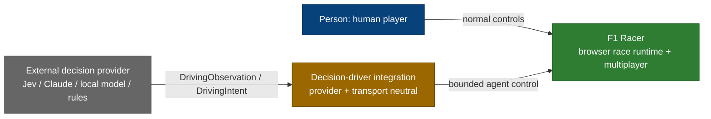
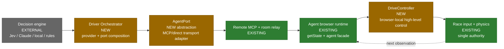
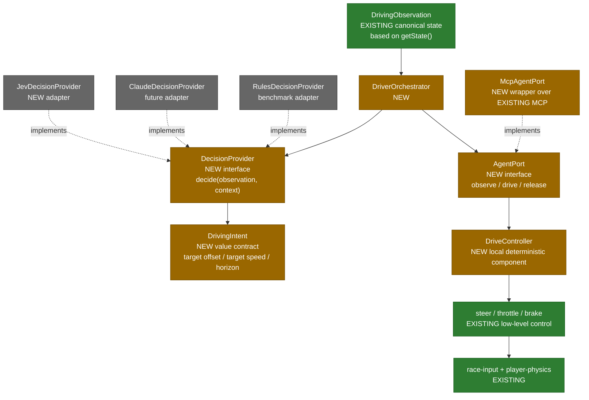
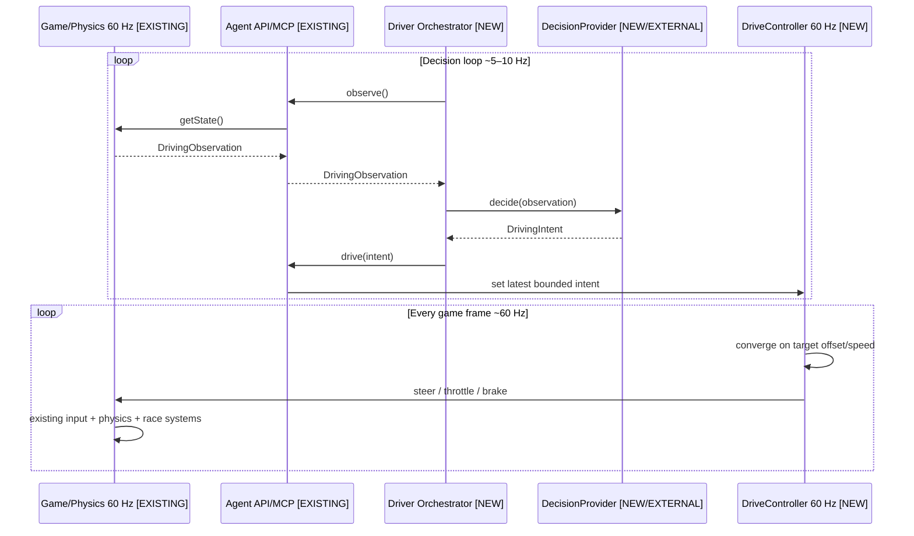
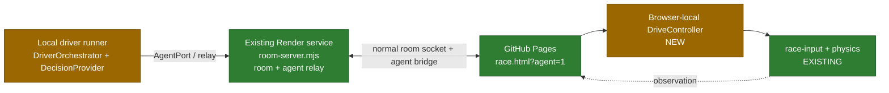

# Provider-agnostic decision driver — C4 and runtime flow

> Status: **Proposed architecture, not implemented**.
>
> Jev is the first candidate adapter. The architecture deliberately does not
> depend on Jev, TypeSafe, Ollama, Claude or any one transport.
>
> Raw rationale: [provider-agnostic driver discussion](../../raw/2026-10-04-provider-agnostic-decision-driver-discussion.md).

Related current architecture:
[agent control](c4-agent-control.md) · [MCP subsystem](c4-mcp.md) ·
[Agent API](../entities/agent-api.md).

## Design goal

Add a high-level AI driving loop without introducing a second physics model and
without turning model latency into steering latency.

The split is:

```text
Decision provider (~5–10 Hz) -> DrivingIntent
                               -> local DriveController (~60 Hz)
                               -> existing race input + physics
```

The provider decides **what target to pursue**. F1 Racer locally decides **how
to turn that target into controls**.

## Status legend

- **EXISTING** — on `master` today.
- **NEW** — required by this proposal.
- **EXTERNAL** — provider/runtime outside the game.

## C4 Level 1 — System context



### Context rule

The decision provider is outside the game authority boundary. It may stop,
restart or be replaced without changing normal human play, room lifecycle,
physics or multiplayer sync.

## C4 Level 2 — Containers



### Container responsibilities

| Container | Status | Owns | Must not own |
|---|---|---|---|
| Decision engine | EXTERNAL | Provider-specific inference/decision | F1 physics or room protocol |
| Driver Orchestrator | NEW | Decision cadence, provider + port composition | Provider-specific branching |
| AgentPort | NEW | `observe / drive / release` transport contract | Decision semantics |
| Remote MCP / room relay | EXISTING | Authenticated command/result transport | Steering policy |
| Agent browser runtime | EXISTING | Live game state and agent endpoint | External provider logic |
| DriveController | NEW | Intent → smooth frame-rate controls | Provider protocol |
| Race input + physics | EXISTING | Authoritative movement | Provider/model state |

## C4 Level 3 — Components and interfaces

The provider family follows the project's OOP rule: one interface, variants
behind it, no provider type switches in callers.



### Proposed contracts

Architectural shape only; exact code/API names remain open.

```text
DecisionProvider
  decide(DrivingObservation, DecisionContext) -> DrivingIntent

AgentPort
  observe() -> DrivingObservation
  drive(DrivingIntent)
  release()

DrivingIntent
  targetOffsetMeters
  targetSpeedKmh
  horizonMs
  confidence?        // open: control input or diagnostics only
```

A provider-specific adapter may internally use discrete choices, logits,
generated text or any other mechanism. It must return the same neutral
`DrivingIntent`.

## C4 Level 4 — Proposed code direction

Do not treat these as final filenames. They document ownership boundaries for a
future implementation.

```text
decision/
  DecisionProvider
  DriverOrchestrator
  DrivingIntent
  providers/
    JevDecisionProvider
    RulesDecisionProvider

transport/
  AgentPort
  McpAgentPort

race/
  DriveController

existing convergence:
  agent-api.js -> race-input.js -> player-physics.js / main.js
```

One factory/composition point may select a provider. Callers after that point
must not switch on provider type.

## Runtime flow — what exists and what is new



### Same flow as a status map

```text
[EXISTING] f1_observe / getState
       |
       v
[EXISTING] DrivingObservation
       |
       v
[NEW] DecisionProvider abstraction
       |
       +---- [EXTERNAL] Jev adapter
       +---- [EXTERNAL] Claude / local model
       +---- [NEW] rules baseline
       |
       v
[NEW] DrivingIntent
       |
       v
[NEW] AgentPort.drive(intent)
       |
       v
[NEW] browser-local DriveController
       |
       v
[EXISTING] race-input
       |
       v
[EXISTING] physics / main loop
       |
       v
[EXISTING] multiplayer car_state / rendering
```

## Why the local controller is the architectural pivot

Do **not** build:

```text
remote provider -> ~60 remote calls/sec -> f1_act -> physics
```

That makes network/model jitter visible as steering jitter.

Build:

```text
provider 5–10 Hz -> intent -> local controller 60 Hz -> existing physics
```

The controller keeps a bounded lease and fails neutral. Human input must keep
the existing immediate-takeover rule.

## Provider agnosticism

Adding another decision engine should require one provider implementation and
composition/factory registration only.

The following are forbidden design leaks:

- provider-specific fields in physics;
- Jev-specific branches in race input;
- provider-specific messages in the room protocol;
- model calls from `main.js`;
- a provider writing car position/velocity directly;
- a remote provider owning the 60 Hz control loop.

## Transport agnosticism

The orchestrator depends on `AgentPort`, not directly on MCP.

The first implementation can wrap the existing MCP path. A direct/local
transport may be added later without changing providers.

A high-level `drive(intent)` operation may require an additive game-facing
tool. Its exact MCP name is **Open**; existing `f1_act`, `f1_enqueue`,
`f1_observe` and `f1_release` remain valid and must not be removed.

## Jev as first adapter

A Jev adapter can stay small:

```text
DrivingObservation
  -> compact Jev state
  -> bounded candidate intents
  -> Jev choice/score
  -> selected candidate
  -> DrivingIntent
```

This lets Jev experiment with racing without making any Jev request/response
shape part of the F1 Racer domain.

The statement that Jev itself is a diffusion model is **Needs verification**
and is irrelevant to this boundary.

## Acceptance rules for future implementation

1. Normal F1 Racer works with no decision provider process.
2. Human multiplayer works with no MCP process.
3. Existing Room Bot remains independent.
4. Existing low-level MCP control remains available.
5. Physics/input stay single-source and browser-local.
6. Human takeover still wins immediately.
7. Provider timeout cannot leave an unbounded stale command.
8. Replacing Jev does not touch race physics/multiplayer/UI.
9. Replacing MCP transport does not touch decision providers.
10. One provider implementation contains all provider-specific protocol logic.

## Open implementation decisions

- Final `DrivingIntent` fields and bounds.
- Where the local `DriveController` plugs into the current Agent API.
- Whether `drive(intent)` becomes a new MCP tool or is exposed through a
  separate local driver channel.
- Decision cadence and intent lease defaults.
- Confidence semantics.
- Jev median/p95 latency and quality against a deterministic rules baseline.


## OOP implementation plan

The implementation follows [the project OOP rules](../concepts/oop.md):
variants sit behind one interface and callers do not switch on concrete types.

```text
DecisionProvider
  ├─ RulesDecisionProvider       deterministic baseline
  ├─ JevDecisionProvider         first model adapter
  └─ future providers

AgentPort
  ├─ RelayAgentPort              existing agent relay / AgentBridgeClient
  ├─ McpAgentPort                remote MCP transport
  └─ future transports

DriverOrchestrator(provider, port)
  └─ coordinates observation → decision → intent

DriveController
  └─ one provider-neutral browser-local controller
```

A factory/composition root may select implementations once from configuration.
After construction, neither `DriverOrchestrator` nor race/physics code may
contain provider/transport type switches.

Development order:

1. value contracts (`DrivingObservation`, `DrivingIntent`);
2. `DecisionProvider` and `AgentPort` families;
3. `RulesDecisionProvider` baseline;
4. `RelayAgentPort` over the existing agent relay;
5. browser-local `DriveController`;
6. full-lap baseline test;
7. `JevDecisionProvider`;
8. same-observation rules-vs-Jev comparison.

## Test deployment — reuse the existing Render backend

**Feasible and preferred for the first test**, provided Render stays the room
and agent-relay backend rather than becoming the inference host.



The current Render service already provides the exact provider-neutral duties
needed here: room lifecycle, participant binding and command/result relay.

For the first Jev experiment, run the model and driver runner locally and reuse
the deployed Render backend. Do **not** put Jev/model inference in
`room-server.mjs`: that would couple room availability to a provider and
break the current responsibility boundary.

The existing `agent-mcp-http.mjs` remains a separate optional transport.
A local Jev test does not need a second Render service: `RelayAgentPort` can
wrap the existing `AgentBridgeClient` directly. When a remote MCP-native
client is the decision source, `McpAgentPort` can use the current MCP process.

This matters operationally because the current free Render room service is
already configured to consume almost the whole monthly free-hour allowance;
the architecture must not assume a second free Render web service.

### First end-to-end acceptance test

The first meaningful test is:

```text
RulesDecisionProvider
        ↓
DriverOrchestrator
        ↓
RelayAgentPort
        ↓
existing Render room/agent relay
        ↓
GitHub Pages agent browser
        ↓
DriveController
        ↓
existing input/physics
```

Then replace only `RulesDecisionProvider` with `JevDecisionProvider`.

If that swap requires no change to Render, `AgentPort`, `DriveController`
or physics, provider agnosticism has been demonstrated rather than assumed.
