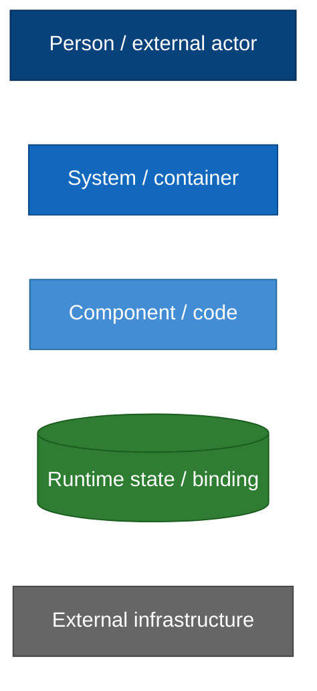
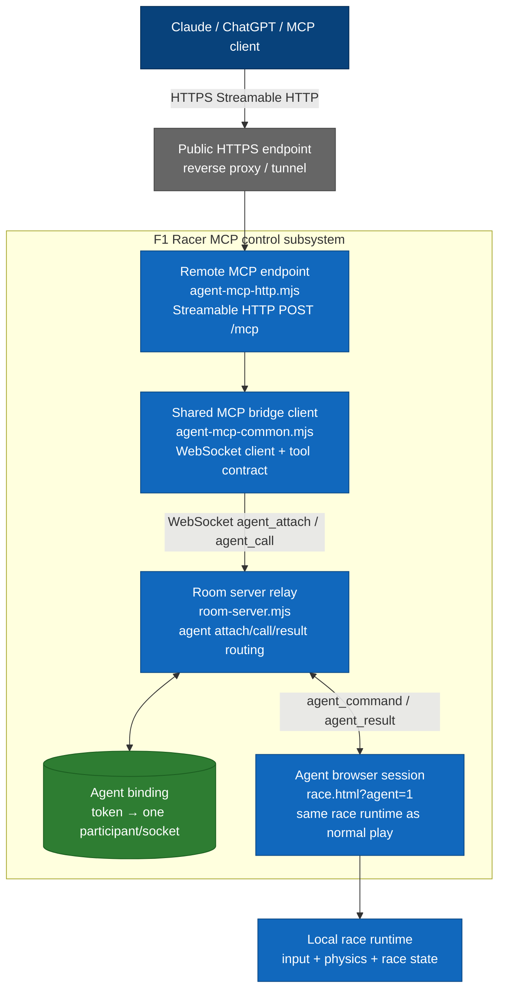
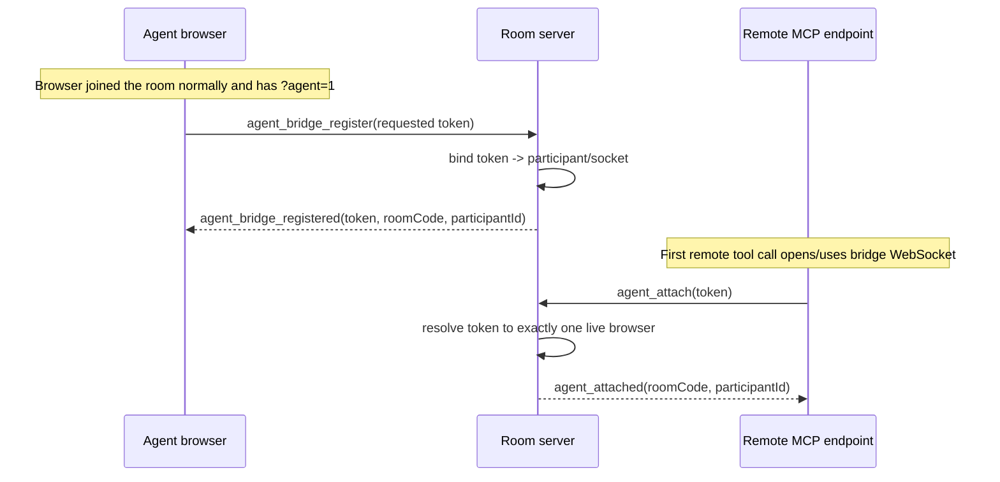
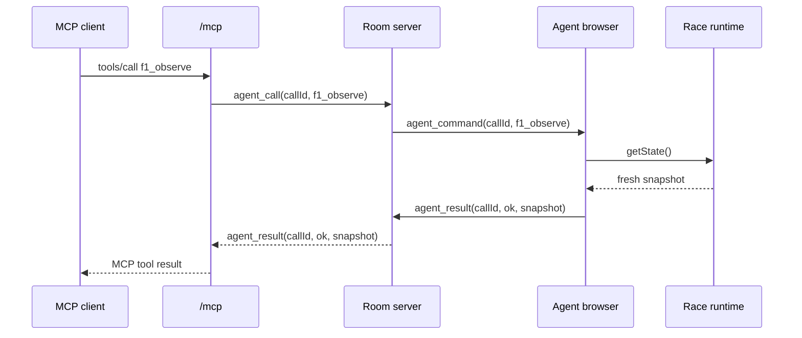
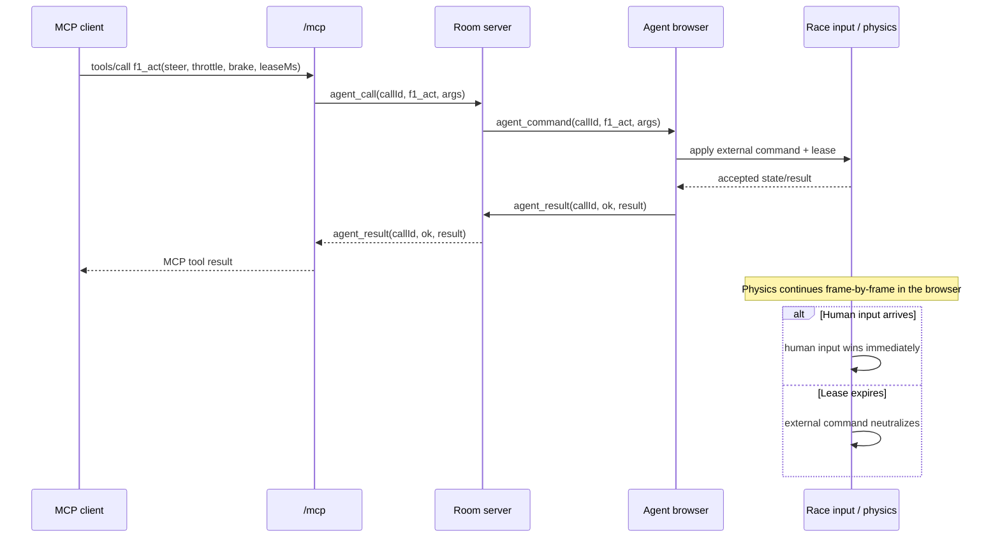
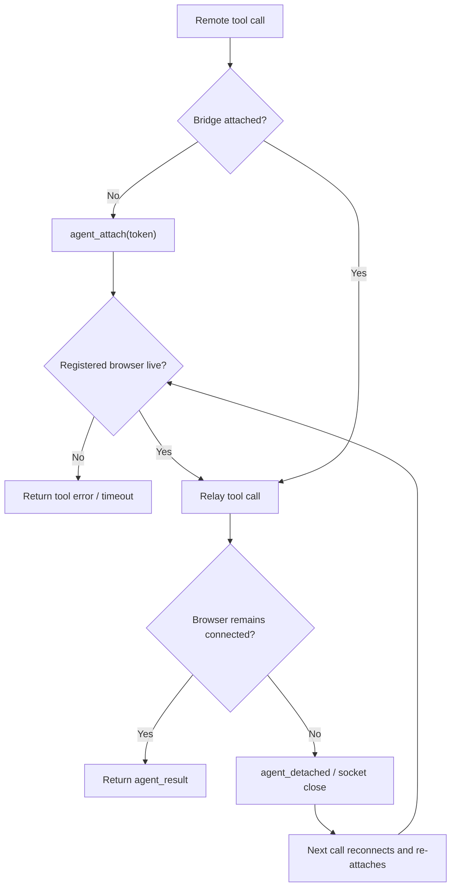
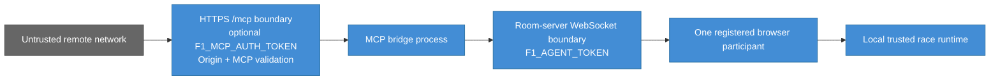
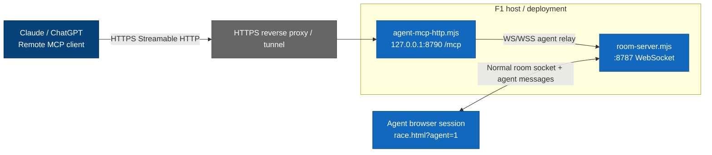

# F1 Racer MCP subsystem — C4 levels 1 to 4

> Focused architectural zoom of the **remote MCP control path only**.
> This document complements, and does not replace,
> [Agent control coexistence](c4-agent-control.md).
>
> The invariant is simple: **MCP is an optional remote adapter, not a second
> game engine**. The browser remains authoritative for its own car and keeps
> using the same input and physics pipeline as every other mode.

## Visual legend



## C4 Level 1 — System context

```mermaid
flowchart LR
  client["External AI client<br/>Claude, ChatGPT, other MCP client"]:::person
  mcp["F1 Racer MCP control subsystem<br/>Remote tools for one registered car"]:::container
  game["F1 Racer browser race runtime<br/>Owns local input, physics and car state"]:::container
  room["F1 Racer multiplayer room service<br/>Owns participant/session routing"]:::container
  edge["HTTPS/WSS reverse proxy or tunnel"]:::external

  client -->|"Streamable HTTP /mcp"| edge
  edge --> mcp
  mcp -->|"Authenticated agent relay"| room
  room -->|"Command/result relay"| game
  game -->|"State/result for the bound car"| room
  room --> mcp
  mcp --> client

  classDef person fill:#08427b,color:#fff,stroke:#052e56
  classDef container fill:#1168bd,color:#fff,stroke:#0b4884
  classDef external fill:#666,color:#fff,stroke:#444
```



### What this subsystem does

The MCP subsystem turns standard MCP tool calls into commands for exactly one
browser participant:

`f1_observe` · `f1_act` · `f1_enqueue` · `f1_radio` · `f1_release`

It does **not**:

- simulate the car;
- own steering or braking logic;
- own room lifecycle, qualifying or race state;
- control any participant other than the one bound to its bearer token;
- replace the existing multiplayer or Room Bot workflows.

## C4 Level 2 — Containers



### Container boundaries

| Container | Owns | Does not own |
|---|---|---|
| Remote MCP endpoint | MCP HTTP protocol, request validation, optional Bearer auth, `tools/list` / `tools/call` | Race state, room state, physics |
| Shared MCP bridge client | Four-tool contract, WebSocket attach/call lifecycle, call correlation/timeouts | Player identity selection, strategy |
| Room server relay | Token registration, controller attachment, routing to exactly one participant | Driving decisions, tool semantics |
| Agent browser session | Registration of its own bridge and execution of the four tool calls | Other participants |
| Local race runtime | Real input state, physics, progress and state snapshots | MCP transport |

## C4 Level 3 — Components

```mermaid
flowchart LR
  subgraph http["agent-mcp-http.mjs"]
    protocol["MCP protocol adapter<br/>discover / initialize / tools/list / tools/call"]:::component
    security["HTTP boundary<br/>Accept/version/method/origin/Bearer checks"]:::component
  end

  subgraph common["agent-mcp-common.mjs"]
    tools["MCP_TOOLS<br/>four shared tool schemas"]:::component
    client["AgentBridgeClient<br/>connect / callTool / timeout / reconnect"]:::component
  end

  subgraph server["room-server.mjs"]
    register["agent_bridge_register<br/>browser registers token"]:::component
    attach["agent_attach<br/>external controller binds token"]:::component
    call["agent_call / agent_result<br/>correlated relay"]:::component
    map[("agentBridges + participant bindings")]:::data
  end

  subgraph browser["Browser multiplayer + race"]
    roomClient["room-client.js<br/>onAgentCommand / sendAgentResult"]:::component
    raceMp["race-multiplayer.js<br/>registerAgentBridge()"]:::component
    api["agent-api.js<br/>invokeAgentTool()"]:::component
    control["act / enqueue / release<br/>lease + human takeover"]:::component
    observe["getState()<br/>fresh race snapshot"]:::component
    input["race-input.js<br/>external steer/throttle/brake path"]:::component
    physics["main.js + player-physics.js<br/>single local simulation"]:::component
  end

  security --> protocol
  protocol --> tools
  protocol --> client
  client --> attach
  register --> map
  attach --> map
  attach --> call
  call --> roomClient
  roomClient --> raceMp
  raceMp --> api
  api --> observe
  api --> control
  control --> input
  input --> physics
  observe --> physics
  physics --> observe
  api --> roomClient
  roomClient --> call

  classDef component fill:#438dd5,color:#fff,stroke:#246b9e
  classDef data fill:#2e7d32,color:#fff,stroke:#1b5e20
```

### Responsibility split

The important split is between **transport** and **execution**:

- `agent-mcp-http.mjs` understands MCP and HTTP.
- `agent-mcp-common.mjs` understands how to reach one registered F1 browser.
- `room-server.mjs` understands where that browser is connected.
- `agent-api.js` understands the four game-facing operations.
- `race-input.js` and the physics runtime actually move the car.

No earlier layer is allowed to bypass a later layer and write race state directly.

## C4 Level 4 — Code path for a tool call

```mermaid
flowchart LR
  request["POST /mcp<br/>tools/call"]:::component
  handle["handleRpc()<br/>agent-mcp-http.mjs"]:::component
  invoke["AgentBridgeClient.callTool()"]:::component
  ws["WebSocket send<br/>agent_call {callId, tool, args}"]:::component
  server["room-server.mjs<br/>validate attached controller"]:::component
  route["route to registered race socket"]:::component
  command["room-client.js<br/>agent_command"]:::component
  dispatch["agent-api.js<br/>invokeAgentTool(name,args)"]:::component
  action["getState / act / enqueue / release"]:::component
  input["race-input + local runtime"]:::component
  result["agent_result<br/>same callId"]:::component
  response["MCP tool result"]:::component

  request --> handle --> invoke --> ws --> server --> route --> command --> dispatch --> action
  action --> input
  input --> action
  action --> result --> server --> invoke --> handle --> response

  classDef component fill:#438dd5,color:#fff,stroke:#246b9e
```



### The four tool paths

| Tool | Browser-side effect |
|---|---|
| `f1_observe` | Builds and returns a fresh snapshot; no control mutation |
| `f1_act` | Applies steer/throttle/brake immediately under a bounded lease |
| `f1_enqueue` | Applies a bounded queue of short driving segments |
| `f1_radio` | Sends a short radio message (max 80 chars) shown to the whole room (#288) |
| `f1_release` | Drops the agent command and returns external control to neutral |

## Dynamic view — registration and attachment



The MCP HTTP bearer token and the F1 agent token serve different boundaries:

- `F1_MCP_AUTH_TOKEN` protects the public `/mcp` endpoint itself;
- `F1_AGENT_TOKEN` identifies the one browser participant the bridge may drive.

They should not be treated as interchangeable credentials.

## Dynamic view — f1_observe



No room or MCP component reconstructs race state; the snapshot originates from
the live browser runtime.

## Dynamic view — f1_act



The model may make another decision later, but the HTTP/MCP request is not a
60 Hz simulation loop. The browser keeps simulating continuously between tool
calls.

## Failure and recovery semantics



### Safety / recovery rules

- If the race page closes, leaves the room or replaces its bridge registration,
  the server revokes/detaches the controller.
- Pending calls fail instead of silently controlling a different participant.
- A subsequent MCP tool call reconnects and attaches again using the configured
  token if the browser has re-registered it.
- `f1_act` never grants an unbounded command: lease expiry neutralizes it.
- Real human input in that browser interrupts external control immediately.
- The room server cannot redirect one valid token to another live participant
  without a new registration.

## Trust boundaries



There are two independent authorization questions:

1. **May this remote caller use the MCP endpoint?**
2. **Which single F1 participant may this bridge control?**

Keeping those questions separate prevents the public transport credential from
becoming a room-wide capability.

## Deployment view



The public deployment can use one hostname with path-based routing or separate
hostnames/tunnels. The MCP process and room server remain separate containers.

## Architectural invariants

Any change to this subsystem must preserve all of the following:

- remote clients enter through the standard Streamable HTTP `/mcp` surface;
- the MCP layer exposes exactly the game-facing tool contract, not raw room
  internals;
- one agent token maps to one live participant;
- the room server only relays commands/results and does not drive;
- the browser executes commands through the existing `agent-api.js` and input
  path;
- the local physics/runtime remains the single source of truth for the car;
- human takeover, command leases and bridge revocation remain effective;
- failure of the MCP endpoint must not affect ordinary human multiplayer or the
  existing Room Bot strategy path.

## Source map

| Layer | Primary source |
|---|---|
| Streamable HTTP MCP | `core/tools/agent-mcp-http.mjs` |
| Shared tool schemas / WebSocket bridge client | `core/tools/agent-mcp-common.mjs` |
| Optional stdio compatibility path | `core/tools/agent-mcp-server.mjs` |
| Agent relay / token binding | `core/server/room-server.mjs` |
| Browser room protocol | `core/client/multiplayer/room-client.js` |
| Browser bridge adapter | `core/client/multiplayer/race-multiplayer.js` |
| Four-tool dispatcher / leases | `core/client/race/agent-api.js` |
| Human/external input convergence | `core/client/race/race-input.js` |
| Local simulation | `core/client/race/main.js`, `player-physics.js` |
