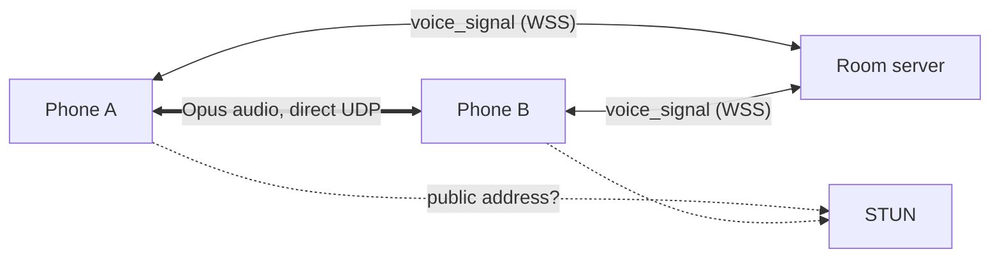
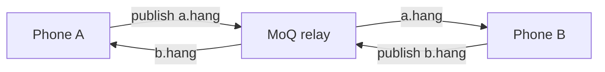

# F1 Racer voice — two flows

The full C4 model (levels 1–4, sequences, comparison) is in
[`llm-wiki/wiki/f1-racer/c4-voice.md`](../llm-wiki/wiki/f1-racer/c4-voice.md).
Decision (`decisions.md`): only `cdn.moq.dev/anon` passed the user's phone
test; the next cycle moves voice to it, with WebRTC as fallback.

**Flow A — WebRTC peer mesh (current, in game).**
- The room server forwards `voice_signal` only: hello, offer, answer, ice and
  voice_state.
- Audio flows phone ↔ phone directly. The only server involved is STUN
  (`stun.l.google.com`). There is no TURN, so peers behind mobile or CGNAT
  networks end in `failed`, and the HUD shows the red "Audio non disponibile"
  icon.
- With N drivers, each phone holds N-1 connections and sends N-1 uploads.

**Flow B — MoQ relay (probe on `voice-probe.html`, not in game).**
- Each phone publishes `f1-racer-probe/<code>/<role>.hang` to a public Media
  over QUIC relay, and subscribes to the others.
  - Relays: `relay.cloudflare.mediaoverquic.com` or `cdn.moq.dev/anon`.
  - Libraries: `@moq/publish` and `@moq/watch` via esm.sh.
- Connections go outbound only, so NAT does not matter. Each phone uploads
  once.
- iOS uses the WebSocket fallback, because Safari lacks WebTransport. This
  **needs verification** on an iPhone.

