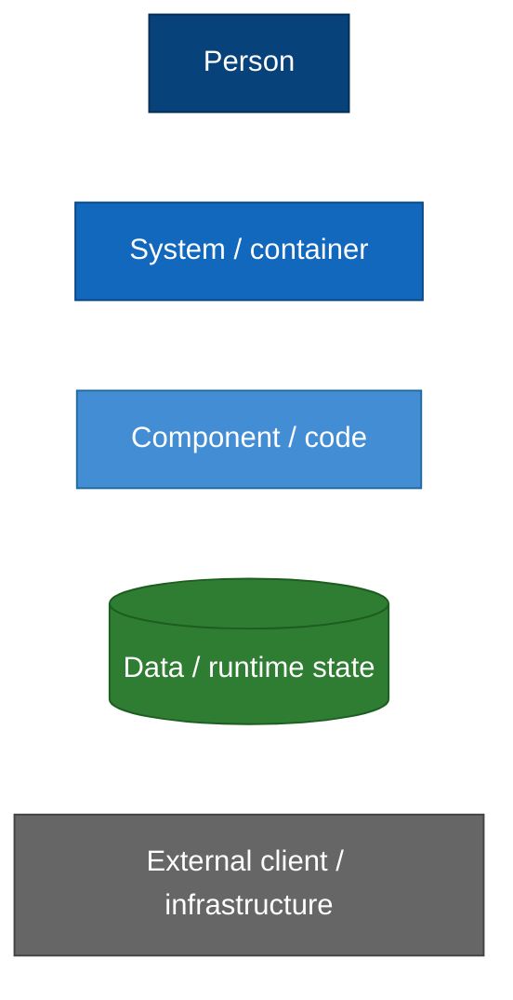
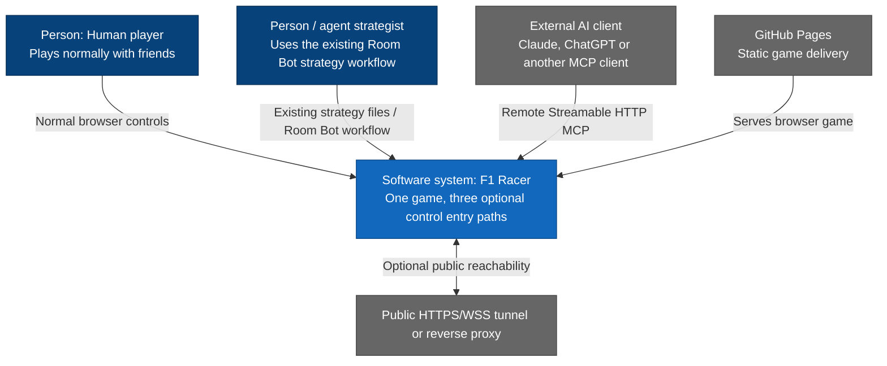
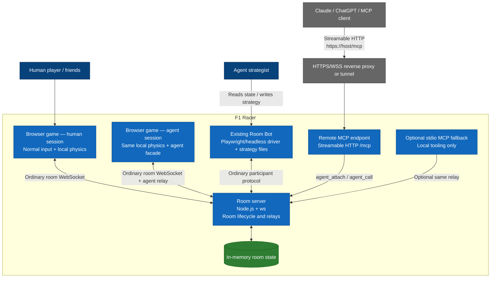
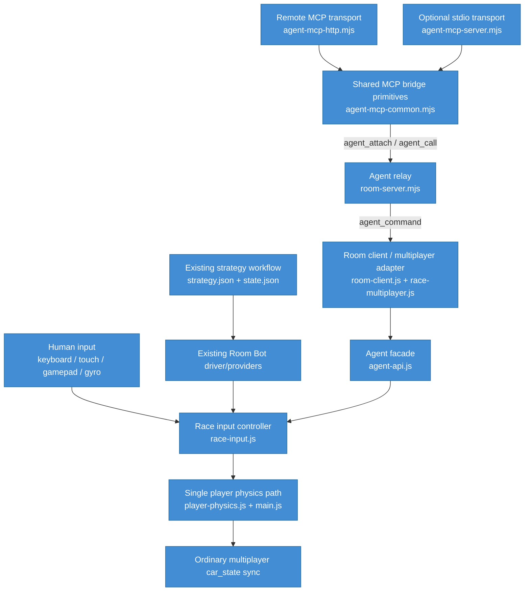
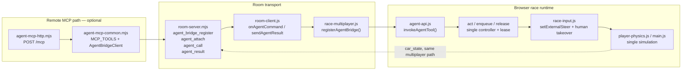
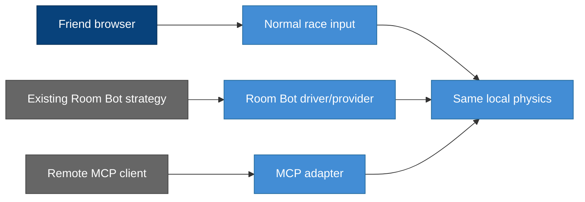
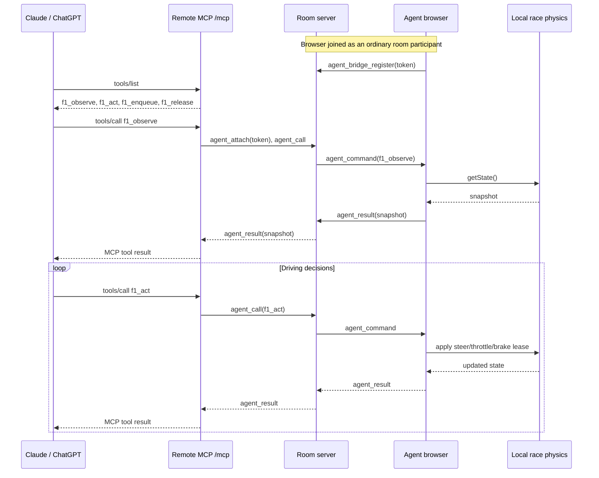
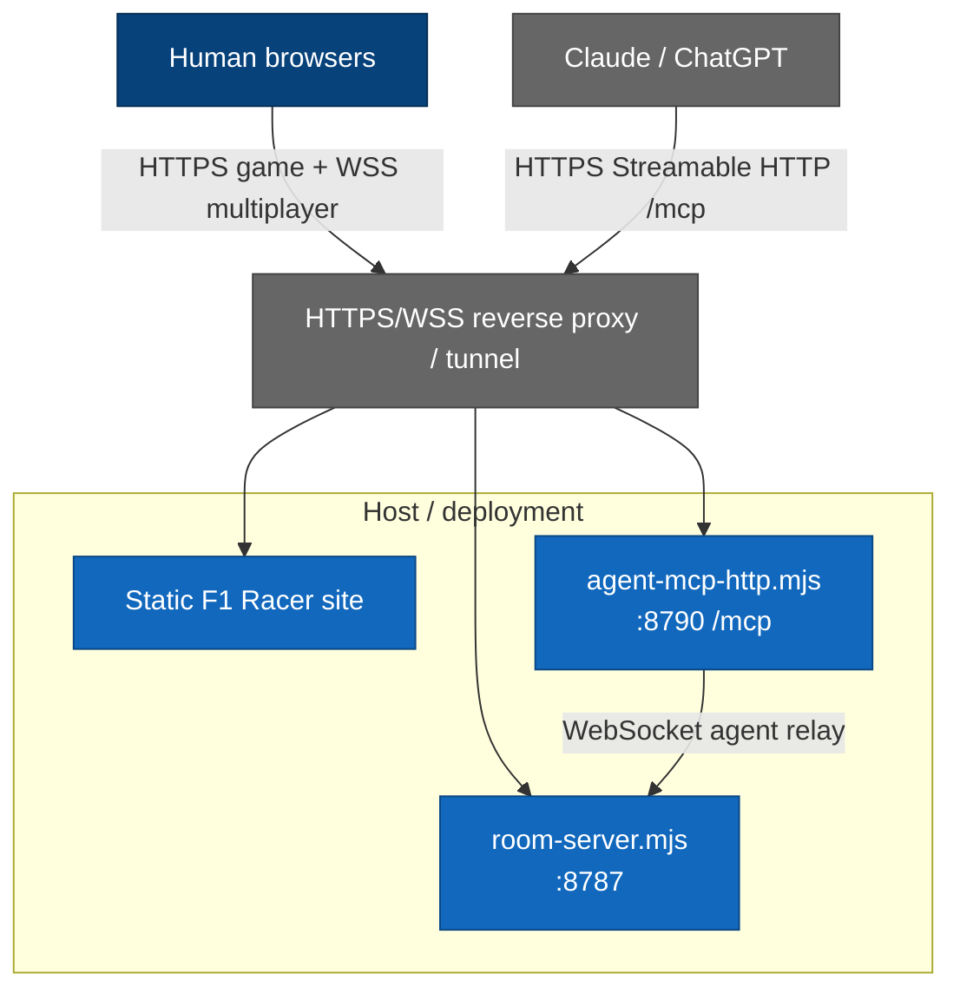

# F1 Racer agent control — C4 levels 1 to 4

> Current/additive architecture for human multiplayer, existing Room Bot
> strategy and remote MCP control. The central constraint is coexistence:
> MCP is an optional adapter and does **not** replace human multiplayer,
> the existing Room Bot strategy workflow, local physics or the room protocol.

## Visual legend

## C4 Level 1 — System context

### Context rule

All three modes are peers, not generations of the same feature:

1. **Human multiplayer** stays the default path and needs no agent flags.
2. **Existing Room Bot + strategy** stays intact and keeps its current
   Playwright/headless + `strategy.json` / `state.json` workflow.
3. **Remote MCP** is an opt-in additional control adapter for one participant
   opened with `?agent=1`.

No path owns F1 physics or room state; they only feed control/strategy into the
same game runtime.

## C4 Level 2 — Containers

### Container responsibilities

| Container | Responsibility | Must not do |
|---|---|---|
| Human browser game | Human input, rendering, physics, multiplayer participation | Depend on MCP or bot tooling |
| Agent browser game | Same rendering/physics plus opt-in `agent-api.js` | Simulate a second physics model |
| Existing Room Bot | Current autonomous driving + live strategy workflow | Be replaced by MCP |
| Room server | Room authority, car-state relay, agent-call relay | Decide steering, braking or strategy |
| Remote MCP endpoint | Translate remote MCP calls to the existing four `f1_*` tools | Own room state or another participant |
| stdio MCP fallback | Optional local access to the same relay | Become the required Claude path |

## C4 Level 3 — Control components

### Control invariants

- There is **one** local race input/physics path.
- Human input keeps precedence over an active agent command.
- `f1_act` uses leases; expiry or `f1_release` returns controls to neutral.
- MCP can control only the participant that registered its bearer token.
- Existing Room Bot providers keep driving exactly as before; MCP does not
  intercept their `strategy.json` / `state.json` contract.
- Human-only rooms never initialize the agent bridge because `?agent=1` is
  absent.

## C4 Level 4 — Key code path

### Existing paths deliberately bypassing MCP

That last view is the architectural guardrail: **three entry paths, one race
runtime**. Removing either of the first two paths in order to simplify MCP is
a regression.

## Dynamic view — remote MCP control

## Deployment view

A deployment may expose room and MCP endpoints through the same public host or
through separate hosts/tunnels. They remain separate processes and protocols.

## Regression boundary

Any future change to the agent integration must preserve these acceptance
rules:

- a room with only human friends works with no MCP process running;
- the existing Room Bot/strategy workflow works with no MCP process running;
- enabling remote MCP affects only the browser participant that opted in with
  `?agent=1` and registered the matching token;
- room lifecycle, qualifying, race sync, voice and normal `car_state` relays
  remain independent of MCP availability;
- physics/input code is shared rather than duplicated.
