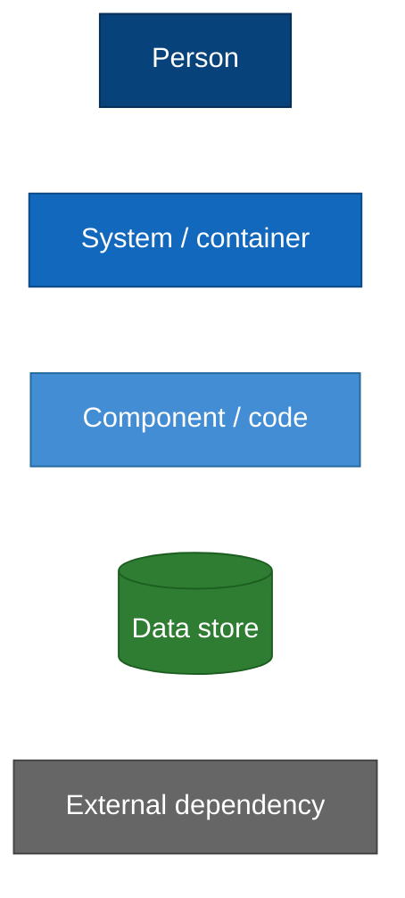
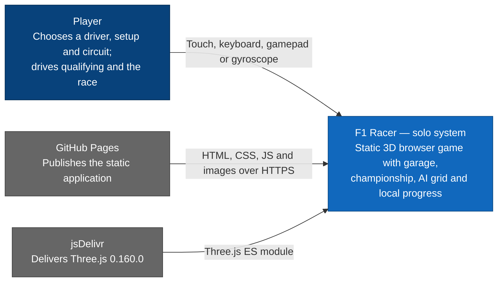
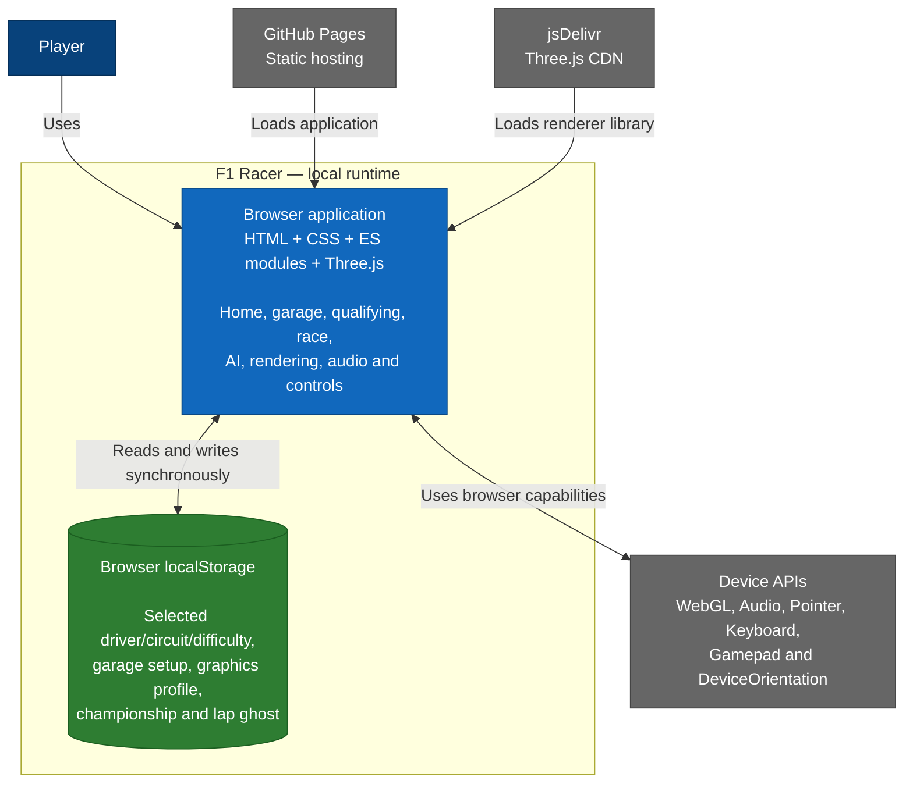
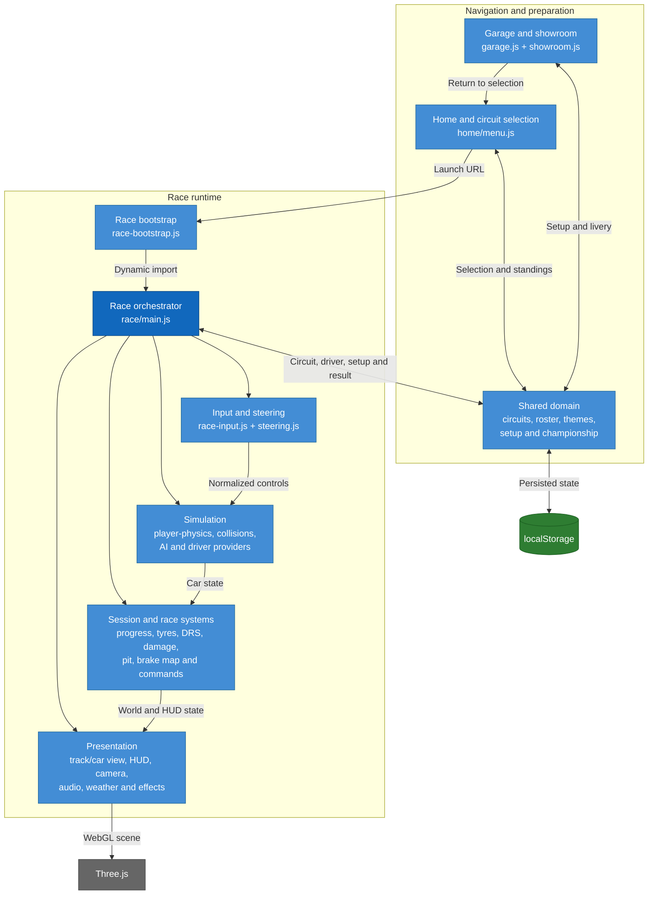
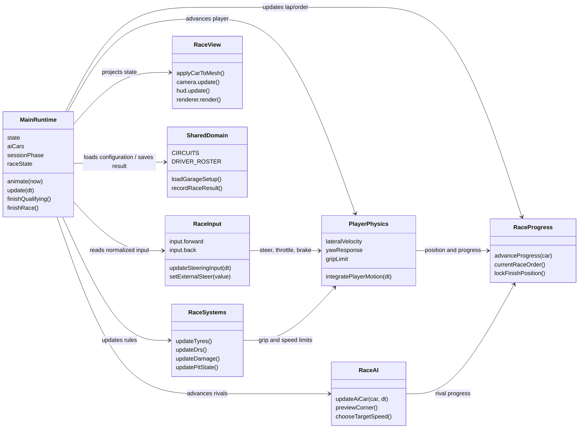
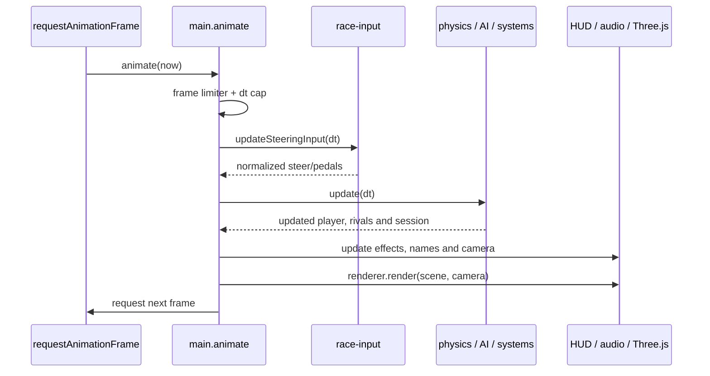
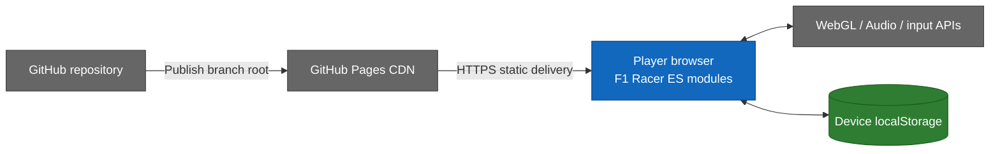

# F1 Racer solo/local — C4 levels 1 to 4

> Current architecture. This model follows one solo player from the published
> site down to the JavaScript modules that update the car every frame.

## Visual legend

## C4 Level 1 — System context

The local product is a browser game. The player never needs the multiplayer
server: all simulation and persistence required for solo play live on the
device.

### Context boundary

- No login or remote profile exists.
- No application backend participates in a solo session.
- GitHub Pages and jsDelivr deliver code; they do not receive gameplay state.

## C4 Level 2 — Containers

The static files become one executable browser container after loading. The
only application data store is the browser's own `localStorage`.

### Container contract

The browser owns the entire local consistency boundary: input, simulation,
rendering, qualifying, grid synthesis, race result and championship update are
committed in the same JavaScript runtime.

## C4 Level 3 — Browser components

### Component responsibility rule

`main.js` is the composition root: it constructs the world, owns live state and
connects focused modules through setup functions and callbacks. The focused
modules implement behaviour but do not independently bootstrap the page.

## C4 Level 4 — Race code

The code view focuses on the critical per-frame path rather than showing every
helper function.

### Per-frame execution

## Local deployment

## Local architectural consequences

- The game remains playable if the multiplayer service is unavailable.
- Performance and determinism depend on each device/browser.
- Championship and setup cannot follow the player to another device.
- Manual query-string version propagation is part of the deployment contract.
- `main.js` is still the principal coupling hotspot despite the extracted
  modules.

