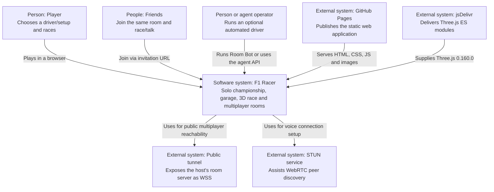
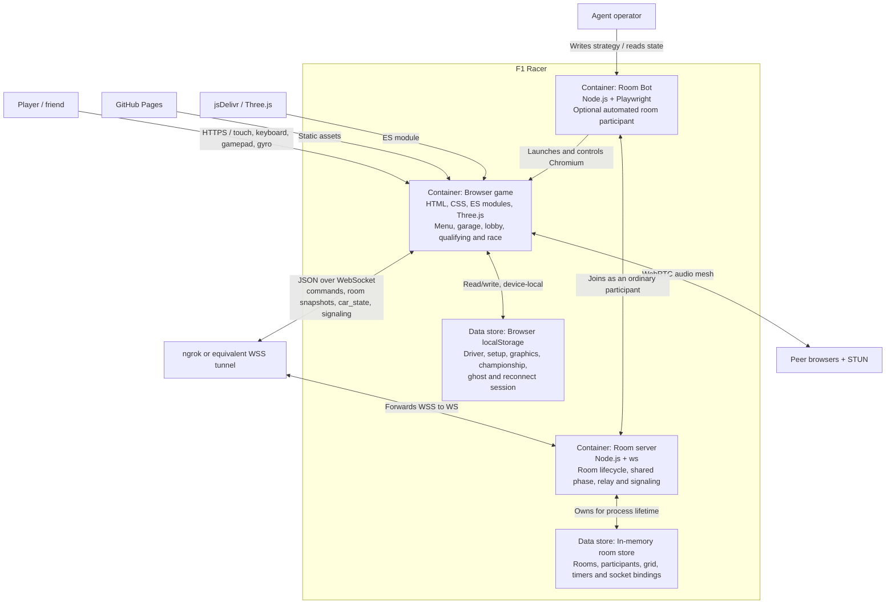
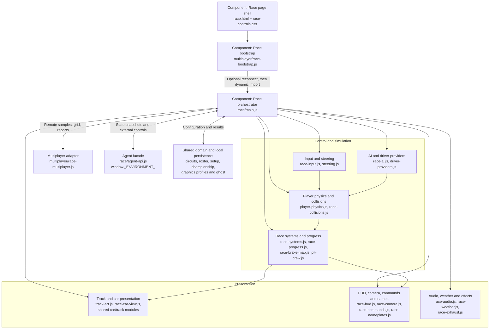
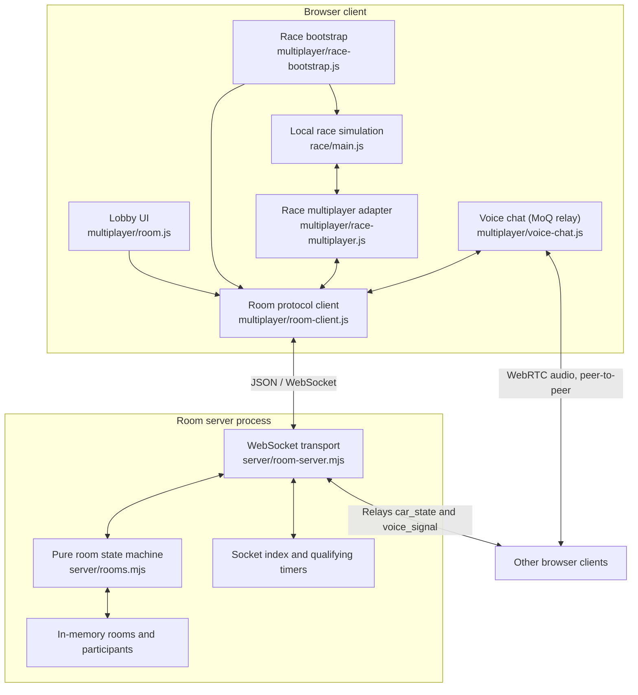
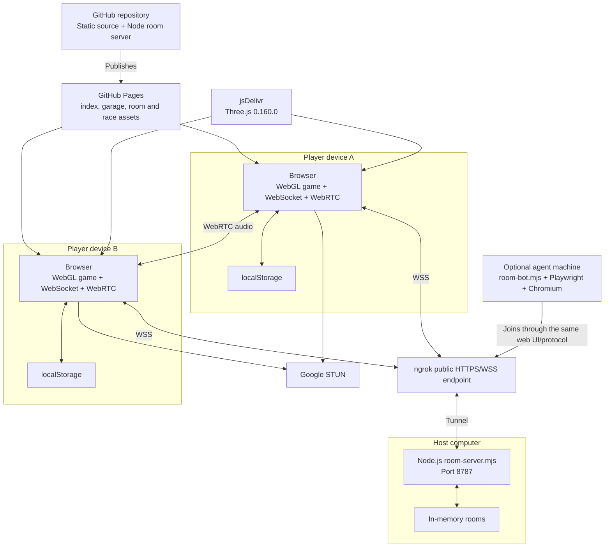
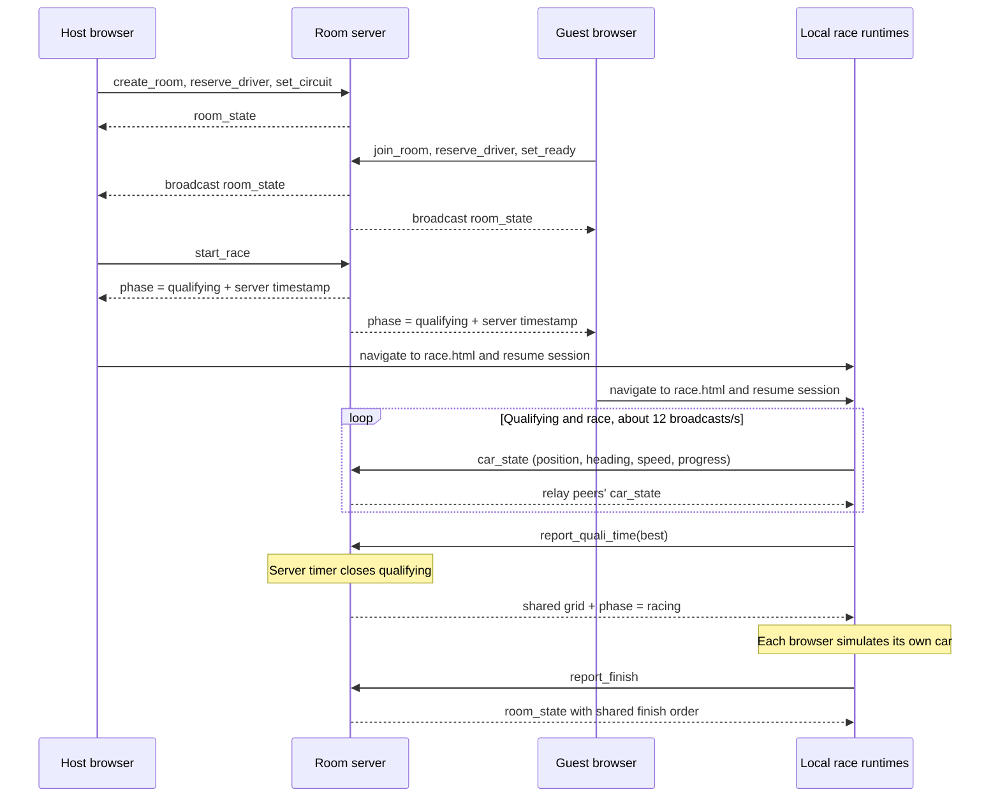

# F1 Racer — C4 architecture model

> As-is model of `master` at 2026-09-27. Planned elements are explicitly
> labelled; everything else describes the code currently in the repository.

## Detailed four-level models

This page is the combined architectural map. The two runtime types each have
their own complete C4 path, kept separate so local and multiplayer concerns do
not blur into one oversized diagram:

- [Solo/local — C4 levels 1 to 4](c4-local.md)
- [Multiplayer — C4 levels 1 to 4](c4-multiplayer.md)
- [Agent control coexistence — C4 levels 1 to 4](c4-agent-control.md)
- [MCP subsystem — C4 levels 1 to 4](c4-mcp.md)

Both detailed documents use the same visual language: people are dark blue,
systems/containers are blue, code components are light blue, data stores are
green and external infrastructure is grey.

## Scope and architectural drivers

F1 Racer is one product with two runtime shapes:

1. a static, browser-only solo game delivered by GitHub Pages;
2. an opt-in multiplayer topology where the same browser game connects to a
   small Node.js room server while every browser remains authoritative for its
   own car.

The model deliberately treats the static game and the room server as separate
containers. Solo play must continue to work without the backend, a build step,
an account or a database.

## Level 1 — System context

The **F1 Racer software system** includes the static client, the optional room
server and the repository's room-bot tooling. GitHub Pages, the CDN, the tunnel
and STUN infrastructure are operational dependencies, not application-owned
containers.

## Level 2 — Containers

### Container responsibilities

| Container | Responsibilities | State |
|---|---|---|
| Browser game | Rendering, input, physics, AI, local session state, lobby UI, remote-car interpolation, HUD/audio and agent hooks | Runtime memory plus `localStorage` |
| Room server | Room commands, driver reservation, readiness, host authority, shared session phase, qualifying deadline/grid, reconnect grace, finish reports, state and signaling relay | Process memory only |
| Room Bot | Opens the real browser game, joins a room, runs the same player physics and exchanges strategy/state files | Local files plus Chromium memory |
| Browser storage | Solo preferences/progress and multiplayer reconnect credentials | Device-local, no cross-device synchronization |
| In-memory room store | Shared room model and live socket index | Lost whenever the Node process restarts |

## Level 3 — Browser race client

`race.html` always starts through `multiplayer/race-bootstrap.js`; in solo mode
the bootstrap immediately imports `race/main.js`, while in room mode it first
restores the WebSocket session and hands the connected client to the runtime.

### Race runtime mechanics

- `main.js` remains the composition root and owns the animation loop.
- Each rendered frame shapes input, updates simulation/game systems, updates
  visuals and optionally renders Three.js.
- Player, AI, remote and automated drivers ultimately feed the same local race
  state and visual pipeline, but their control providers differ.
- Remote cars are updated from the latest `car_state`, with smoothing and up to
  0.6 seconds of extrapolation; the server does not simulate them.
- `window._ENVIRONMENT_` is opt-in (`?agent=1`) and currently exposes
  `getState()`, timed `step()` and `release()`.
- `window._DRIVER_` is available to the layered room bot and exposes state plus
  persistent strategic targets; the fast geometric provider still drives each
  frame.

## Level 3 — Multiplayer components

### Authority boundaries

| Concern | Authority | Persistence / trust consequence |
|---|---|---|
| Player physics and controls | Each player's browser | Client-authoritative; the server does not validate motion |
| Remote car position | Originating browser | `car_state` is ephemeral and relayed without storage or reconciliation |
| Room membership and driver reservation | Room server | Shared and authoritative while the process is alive |
| Circuit, difficulty and session start | Host command validated by room server | Broadcast as room state |
| Qualifying end and grid | Room-server timer plus client-reported lap times | One shared deadline; times are trusted client reports |
| Race finish order | Room server, ordered by first finish report received | Network arrival order; not server-simulated track crossing |
| Reconnection | Room server plus reconnect token in browser storage | 30-second default grace period; token is the only resume credential |
| Voice media | Browser peers | Audio bypasses the room server; it only relays SDP/ICE signaling |
| Solo championship/setup/ghost | Local browser | No account, database or cross-device synchronization |

## Deployment view

The tunnel is currently an operational responsibility of the room host. The
free ngrok URL can change between runs, so invitation URLs carry
`roomServer=...` explicitly.

## Dynamic view — lobby to multiplayer race

WebRTC signaling travels over the same WebSocket connection as
`voice_signal`; established audio then flows directly between browsers and is
not part of the loop above. Both voice flows (current mesh and the MoQ relay
probe) are modelled in [c4-voice.md](c4-voice.md).

## Current architectural properties

### Strengths

- Solo mode is deployable as a static site and has no backend availability
  dependency.
- Multiplayer reuses the solo physics and presentation instead of maintaining a
  second game engine.
- The pure `rooms.mjs` state machine is separated from WebSocket transport.
- A single browser protocol client is reused by lobby, race and voice.
- The shared car, circuit, roster and setup modules keep garage and race data
  consistent.
- Agent drivers join the same room and use the same player physics path.

### Limitations and deliberate trade-offs

- Multiplayer is client-authoritative: it is suitable for friendly sessions,
  not competitive anti-cheat play.
- Room state disappears on server restart; there is no database or distributed
  room coordination.
- Finish order and qualifying time depend on trusted client reports.
- Voice uses a full peer mesh. At the current limit of 12 participants this is
  simple, but connection count grows quadratically and no TURN server is
  configured.
- `main.js` is still a large composition root that combines world construction,
  session orchestration and the frame loop even though many behaviours have
  moved into focused modules.
- Static-module cache busting depends on manually propagated query versions.
- The room host currently operates Node.js and the public tunnel manually.

## Agent integration — additive current architecture

The former planned-agent section has been superseded by the implemented
continuous-control/relay work in #201 and the remote Streamable HTTP transport
in #296. The complete C4 view is now kept in
[Agent control coexistence — C4 levels 1 to 4](c4-agent-control.md).

The architectural rule is explicit: MCP is an **optional adapter**, not a new
game runtime. Human multiplayer and the existing Room Bot/strategy workflow
remain valid independently of the MCP process; all control paths converge on
the same browser input/physics pipeline.

## Source map

| Architectural element | Primary source |
|---|---|
| Static entry points | `index.html`, `garage.html`, `room.html`, `race.html`, `modes.html` |
| Race composition root | `core/client/race/main.js` |
| Race modules | `core/client/race/*.js` |
| Shared game/domain data (browser) | `core/client/shared/*.js` |
| Shared with the room server | `core/shared/circuits.js`, `driver-roster.js` |
| Lobby and browser protocol | `core/client/multiplayer/room.js`, `room-client.js` |
| Race multiplayer bridge | `core/client/multiplayer/race-bootstrap.js`, `race-multiplayer.js` |
| Voice chat (MoQ relay, #369) | `core/client/multiplayer/voice-chat.js`, `voice-moq.js` |
| Room transport | `core/server/room-server.mjs` |
| Room state machine | `core/server/rooms.mjs` |
| Agent facade | `core/client/race/agent-api.js`, `driver-providers.js` |
| Automated room participant | `core/tools/room-bot.mjs` (browser), `headless-room-bot.mjs` (Node) — see [agent-bots.md](agent-bots.md) |
