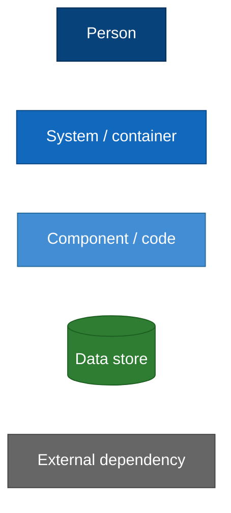
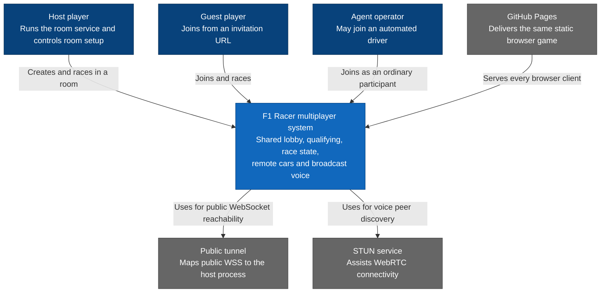
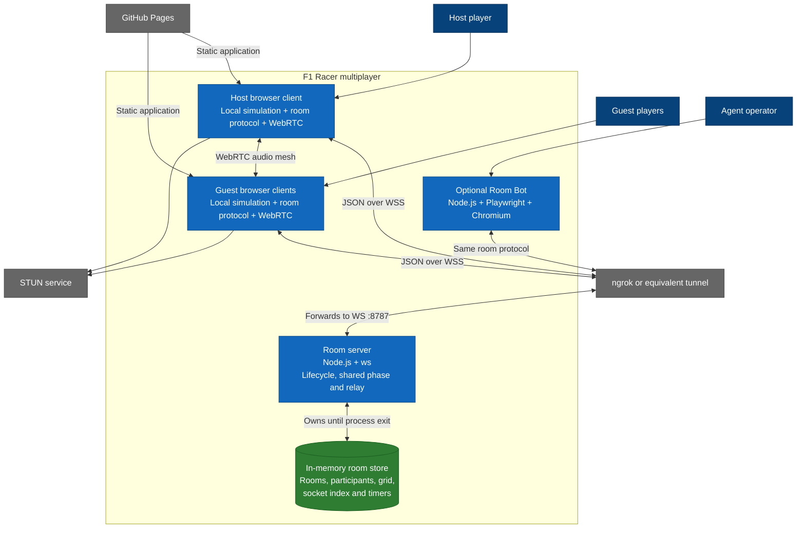
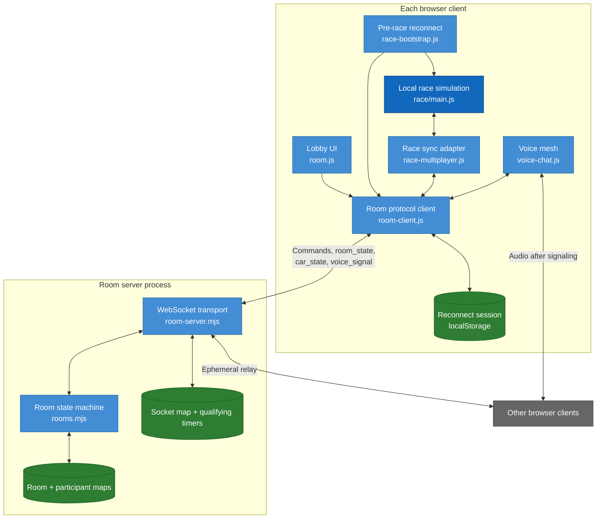
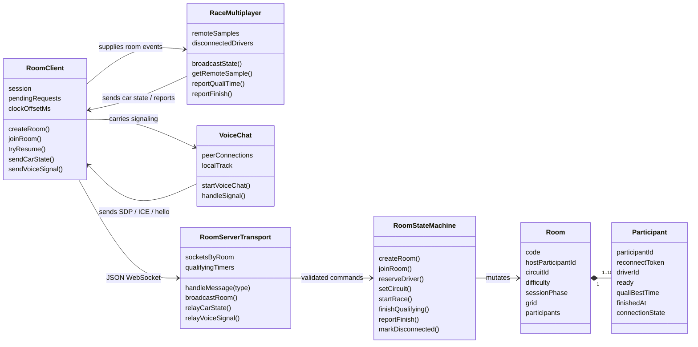
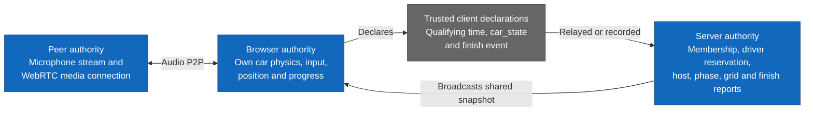

# F1 Racer multiplayer — C4 levels 1 to 4

> Current architecture. This model follows a room from its invitation URL down
> to WebSocket messages, in-memory state and peer-to-peer audio.

## Visual legend



## C4 Level 1 — System context



### Context boundary

F1 Racer multiplayer coordinates friendly sessions; it is not an authoritative
competitive simulation. Each participant's browser simulates and declares its
own car state.

## C4 Level 2 — Containers



### Container boundaries

- The room server is optional and is never imported by the static pages.
- The tunnel is infrastructure, not application logic.
- Room Bot uses the actual page and protocol instead of a privileged server
  endpoint.
- The server stores no voice media and no per-frame car history.

## C4 Level 3 — Multiplayer components



### Two data paths

1. **Reliable room commands:** request/response messages carry a `reqId`; the
   server validates them through `rooms.mjs` and broadcasts a complete public
   room snapshot.
2. **Ephemeral realtime relay:** `car_state` and `voice_signal` are forwarded
   without entering the room state machine. Car samples are not acknowledged or
   stored.

## C4 Level 4 — Protocol and server code



### Message ownership

| Message family | Handler | Stored? | Authority |
|---|---|---:|---|
| `create_room`, `join_room`, `reconnect` | Transport + state machine | Yes | Room server |
| `reserve_driver`, `set_ready`, `set_circuit` | State machine | Yes | Room server |
| `start_race`, qualifying timer, `rematch` | State machine + transport timer | Yes | Room server |
| `report_quali_time`, `report_finish` | State machine | Yes | Client value trusted by server |
| `car_state` | Direct transport relay | No | Originating browser |
| `voice_signal` | Direct transport relay | No | Browser peers |
| WebRTC audio | Never reaches server | No | Browser peers |

## Multiplayer dynamic view

```mermaid
sequenceDiagram
  participant H as Host browser
  participant S as Room server
  participant G as Guest browser
  participant R as Race runtimes

  H->>S: create_room
  H->>S: reserve_driver + set_circuit + set_ready
  G->>S: join_room + reserve_driver + set_ready
  S-->>H: room_state
  S-->>G: room_state
  H->>S: start_race
  S-->>H: phase=qualifying, serverNow
  S-->>G: phase=qualifying, serverNow
  H->>R: race.html reconnects before main.js
  G->>R: race.html reconnects before main.js
  loop Local simulation; broadcast about every 80 ms
    R->>S: car_state
    S-->>R: peers' car_state
  end
  R->>S: report_quali_time(best)
  Note over S: Server qualifying timer expires
  S-->>R: grid + phase=racing + raceStartedAt
  Note over R: Every browser simulates its own car
  R->>S: report_finish
  S-->>R: shared finish order in room_state
```

## Multiplayer authority map



## Multiplayer architectural consequences

- The design is lightweight and appropriate for friendly rooms of up to ten
  participants.
- It does not provide anti-cheat, server reconciliation or deterministic shared
  physics.
- Room recovery cannot survive a room-server restart because there is no durable
  store.
- Finish order is the order in which reports reach the server, not a
  server-observed finish-line crossing.
- The WebRTC full mesh grows quadratically and currently has STUN but no TURN.
- Browser Copilot and future agents must join through the same participant and
  control boundaries; they must not gain direct authority over other cars.

