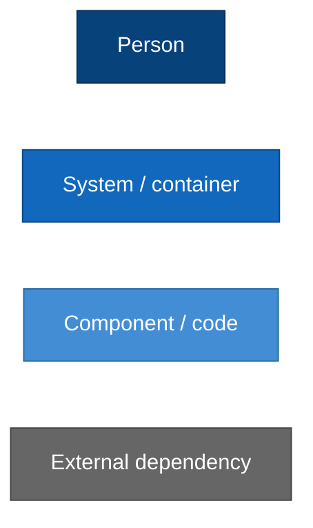
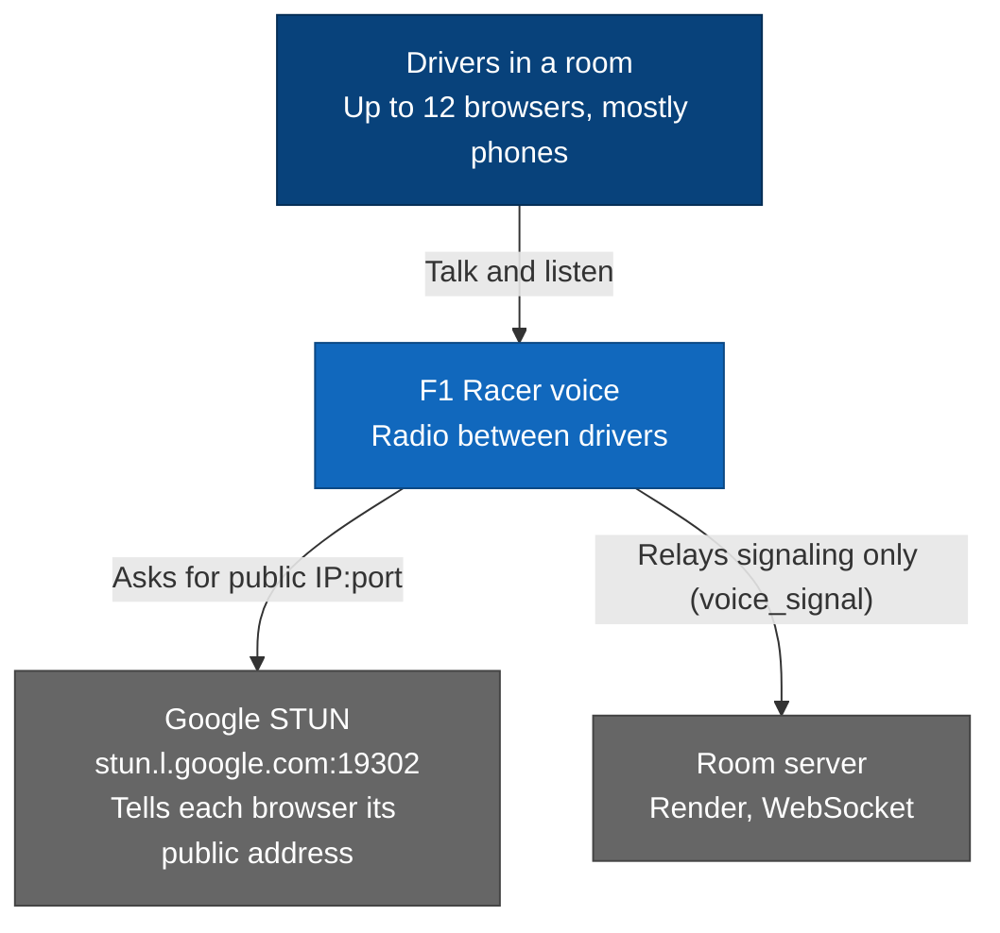
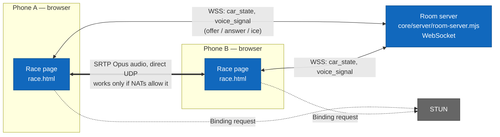
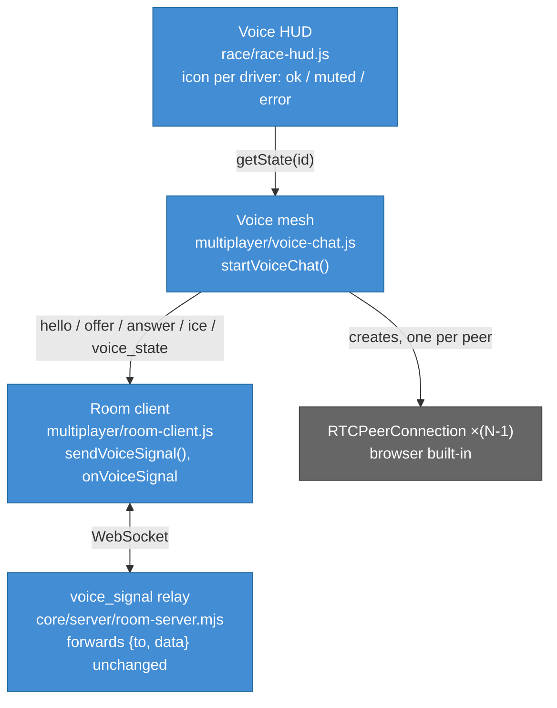
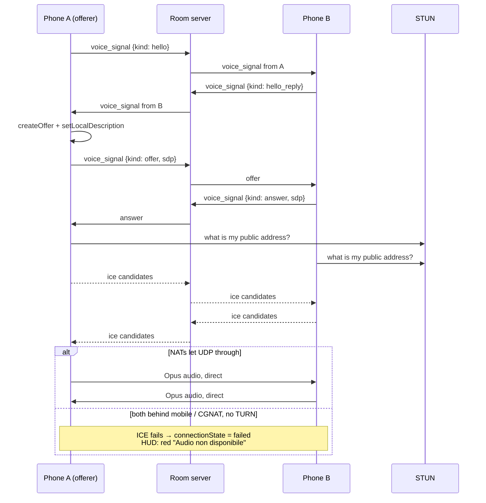
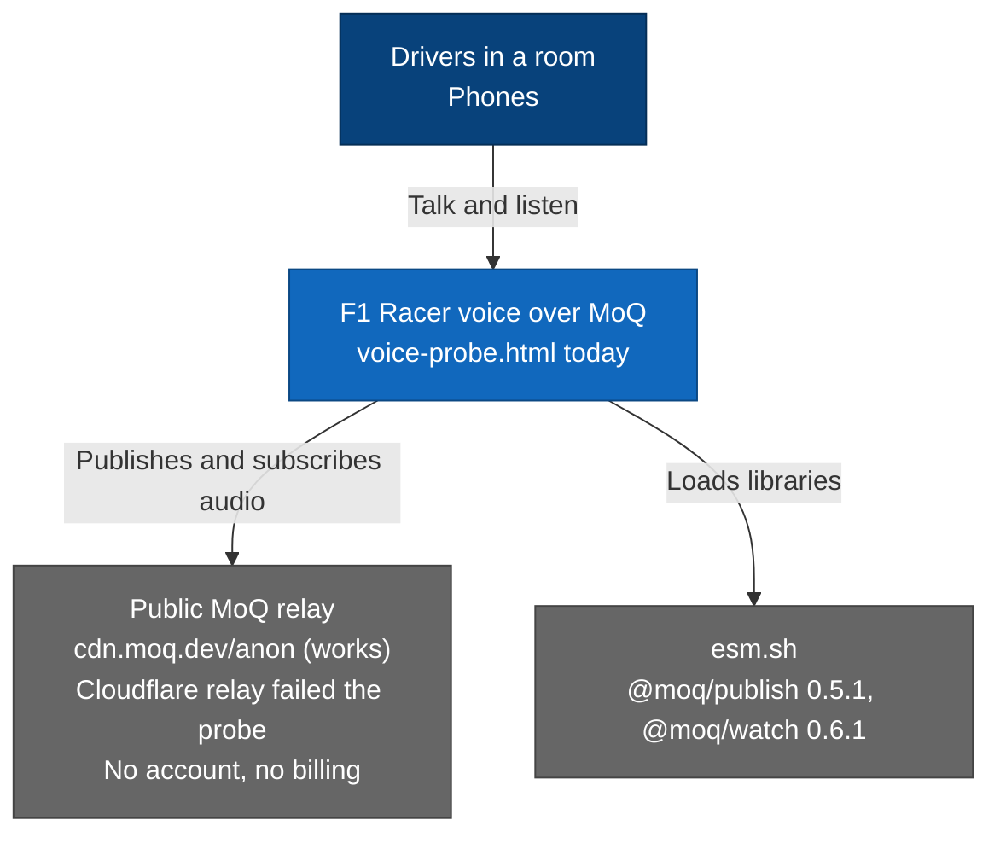
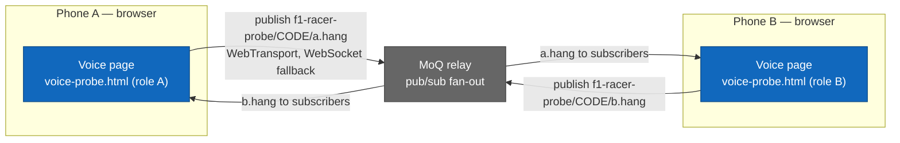
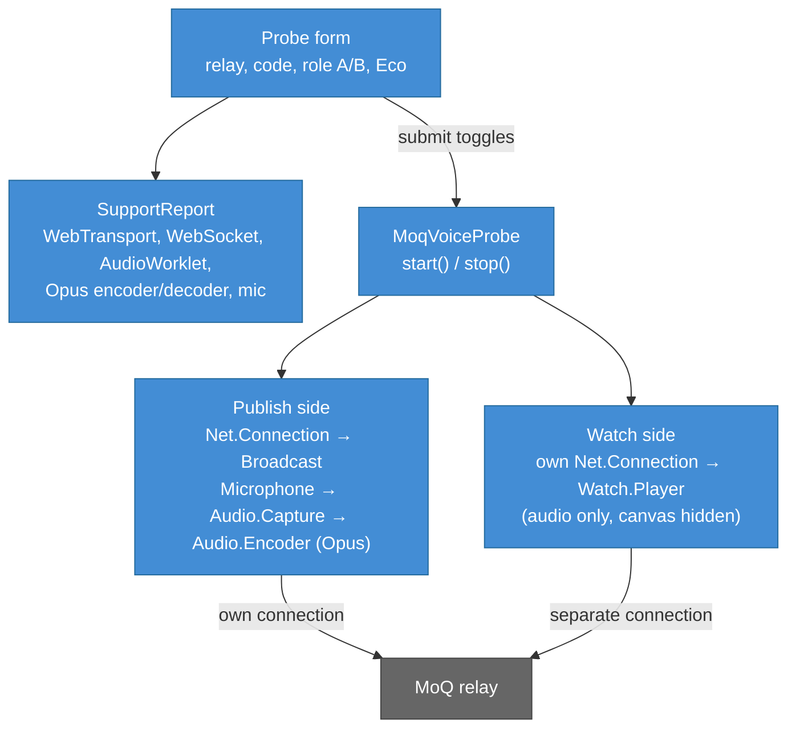
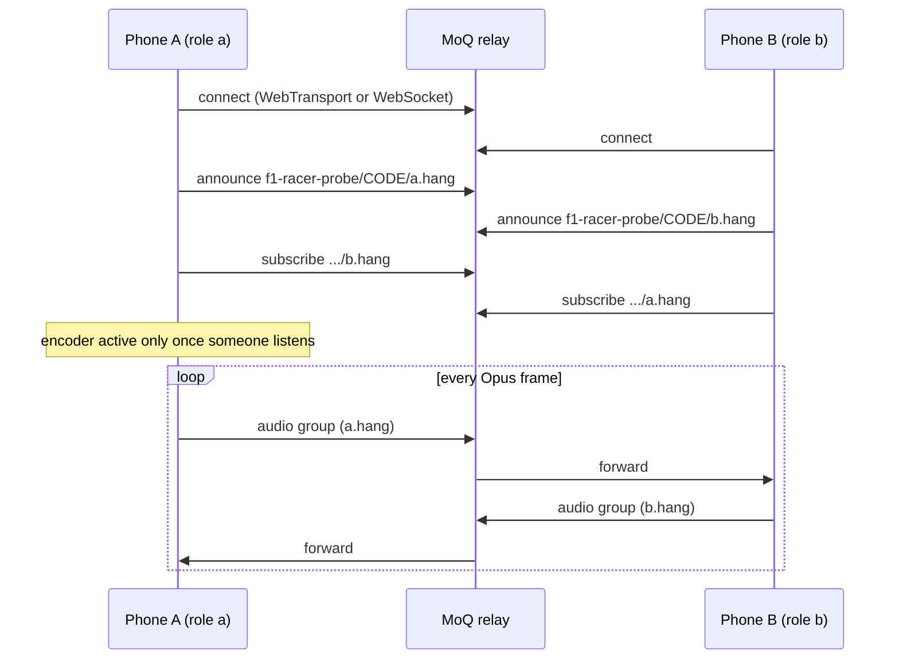

# F1 Racer voice — two flows, C4 levels 1 to 4

> Status (2026-10-04, #369):
> - **Flow B, the MoQ relay on `cdn.moq.dev/anon`, is current** and the only
>   transport: `core/client/multiplayer/voice-moq.js` (`MoqVoiceChat`).
> - **Flow A, the WebRTC mesh, was removed** (user's call): a fallback phone
>   could hear only other fallback phones. A browser without AudioWorklet
>   shows "Audio non disponibile". Flow A stays below as history.
> - `voice-chat.js` picks the transport behind the `VoiceChat` interface in
>   `voice-transport.js` ([oop.md](oop.md)); a new transport is one subclass.
> - Probe history: only moq.dev worked (#361); iPhone ↔ iPhone confirmed
>   after #367. iOS keeps a player's AudioContext suspended until a tap
>   after the audio arrives; racing gives one at once.

## Why two flows

- **Flow A** sends audio directly between browsers, and the only server it
  uses is STUN.
  - The room server relays signaling only; it never carries audio.
  - No TURN server is configured. When both peers sit behind mobile or
    carrier-grade NAT, ICE finds no route. The peer ends up `failed`, and the
    HUD shows the red "Audio non disponibile" icon (bug seen 2026-10-04).
- **Flow B** sends audio through a public Media over QUIC relay. Each phone
  uploads its microphone once, and the relay fans it out, like an SFU.
  - Every connection is outbound to the relay, so NAT type does not matter.
  - It also removes the N×(N-1) mesh load that heats phones at 12 drivers.
- **Fallback if flow B fails on iOS:** add TURN with anti-abuse gating on the
  room server. Credentials go only to active racers, with a short TTL and a
  daily cap. See [decisions.md](decisions.md).

## Visual legend

---

## Flow A — WebRTC peer mesh (removed in #369)

### A · Level 1 — System context

### A · Level 2 — Containers

With N drivers, each phone holds N-1 `RTCPeerConnection`s. It encodes once
and sends N-1 streams. At 12 drivers that is 11 uploads and 11 downloads per
phone.

### A · Level 3 — Components

### A · Level 4 — Code and sequence

These are the key points of `voice-chat.js`:
- `ICE_SERVERS = [{ urls: "stun:stun.l.google.com:19302" }]`. There is no
  TURN entry.
- `isOfferer(id)` decides which side of each pair offers, so the two sides
  never collide.
- `hello` / `hello_reply` restart a stale pair after a page reload.
- Connection states `failed`, `closed` and `disconnected` are dead states.
  For those, `getState(id)` returns `status: "error"`. The HUD then shows
  "Audio non disponibile", in red (`#f78787`, `race-controls.css`).
- Without a mic the peer still joins as `recvonly`, so it can listen.

---

## Flow B — MoQ relay (current)

### B · Level 1 — System context

### B · Level 2 — Containers

Each phone uploads once whatever the number of drivers, and downloads N-1
streams. Every connection is opened from the phone to the relay, so NAT
traversal is not needed. iOS Safari has no working WebTransport, so on iPhone
the library falls back to WebSocket. **Needs verification** on a real
iPhone.

### B · Level 3 — Components (`core/client/multiplayer/voice-probe.js`)

### B · Level 4 — Code and sequence

These are the key points of `voice-probe.js`:
- Broadcast path: `f1-racer-probe/<code>/<role>.hang`.
- The listening role is `OTHER_ROLE[role]`. With Eco on, it is the phone's
  own role, so the sound makes a full round trip through the relay.
- Libraries are preloaded at page load. The tap that starts the probe then
  reaches the mic prompt inside the user gesture, which iOS requires.
- Publish and watch use **separate** connections (`share: false`). This
  mirrors two different phones.

### Step 2 if the probe passes (planned, not built)

These pieces do not exist yet:
- `voice-chat.js` would publish `f1-racer/<roomCode>/<participantId>.hang`,
  and subscribe to each other participant listed in `room_state`.
- The same `getState(id)` contract would feed the HUD unchanged.
- WebRTC would stay as a fallback. Following [oop.md](oop.md), the two
  transports would be two subclasses behind one voice interface.
- `voice_signal` would carry only `voice_state` (mute, has mic). The room
  server would still never carry audio.

## Comparison

| | Flow A — WebRTC mesh | Flow B — MoQ relay |
|---|---|---|
| Audio path | Phone ↔ phone direct | Phone → relay → phones |
| Uploads per phone at 12 drivers | 11 | 1 |
| Mobile / CGNAT | Fails without TURN | Works (outbound only) |
| Server we run | Room server (signaling) | None for audio |
| Cost / account | Free (STUN) | Public relay, no account; no SLA |
| Phone test | Fails across mobile NAT | Works on moq.dev only (2026-10-04) |
| Latency | Lowest when it connects | One relay hop more |
| Privacy | Encrypted end to end (DTLS-SRTP) | TLS to the relay; relay sees the audio |

## Code map

| Concern | File |
|---|---|
| Transport choice | `core/client/multiplayer/voice-chat.js` |
| Interface + speaking meter | `core/client/multiplayer/voice-transport.js` |
| MoQ transport (default) | `core/client/multiplayer/voice-moq.js` |
| Signaling client | `core/client/multiplayer/room-client.js` (`sendVoiceSignal`) |
| Signaling relay | `core/server/room-server.mjs` (`case "voice_signal"`) |
| Voice HUD icon | `core/client/race/race-hud.js`, `race-controls.css` |
| MoQ probe | `voice-probe.html`, `core/client/multiplayer/voice-probe.js` |

Related pages: [c4-multiplayer.md](c4-multiplayer.md),
[c4-model.md](c4-model.md), [decisions.md](decisions.md).
